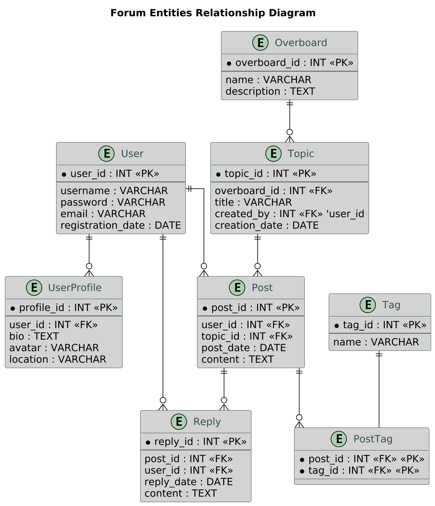

## Current Diagram 



*Entity Relationship Diagram*


## Usage

#### Generating UML Diagrams
To generate UML diagrams from `.txt` files:

- **For a specific `.txt` file:**
  ```bash
  python diagramming.py my_diagram.txt
  ```

- **For all `.txt` files in a directory:**
  ```bash
  python diagramming.py all ./path/to/directory
  ```

The generated PNG files will be saved in the `png` folder in the same directory.

